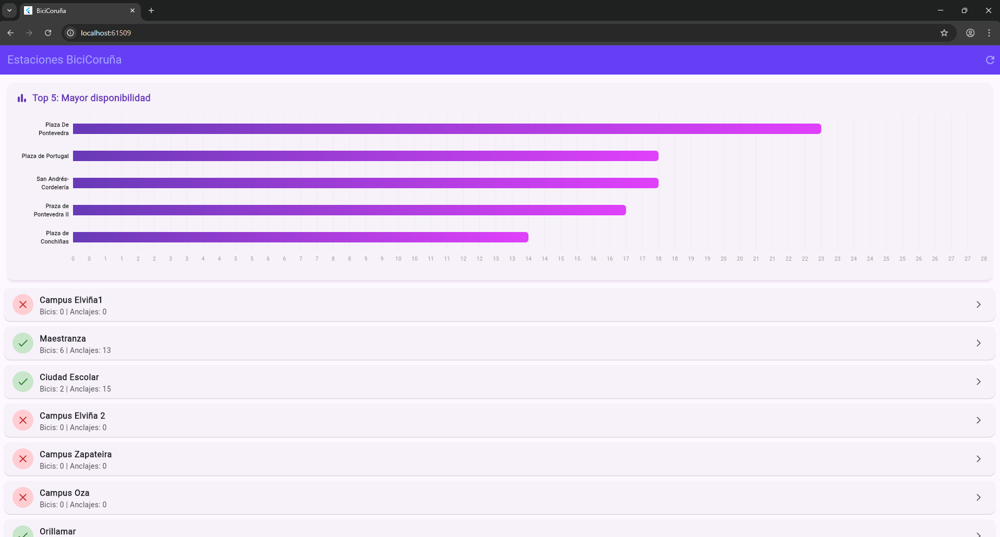
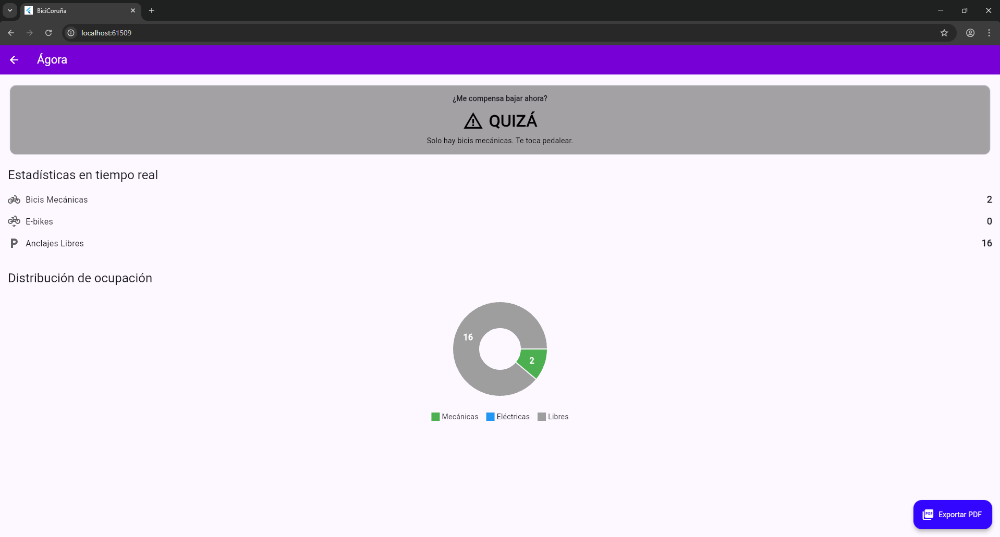
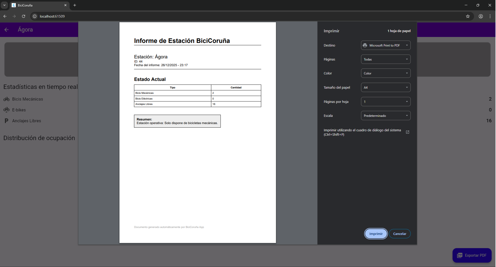

# BiciCoruña App 

Aplicación móvil desarrollada en Flutter para la consulta en tiempo real del estado de las estaciones de BiciCoruña (servicio público de bicicletas).

##  Descripción
Esta aplicación permite a los usuarios visualizar rápidamente la disponibilidad de bicicletas y anclajes en las estaciones de la ciudad, facilitando la toma de decisiones sobre si acudir o no a una estación concreta.

### Funcionalidades principales:
* **Monitorización en tiempo real:** Consulta de datos actualizados desde la API oficial (GBFS).
* **Visualización gráfica:**
    * *Pantalla Principal:* Ranking (Top 5) de estaciones con más bicicletas disponibles.
    * *Detalle de Estación:* Distribución de ocupación (Mecánicas vs Eléctricas vs Libres).
* **Asistente de decisión:** Indicador visual ("Sí", "Quizá", "No") sobre si compensa ir a la estación.
* **Exportación de informes:** Generación de PDF con el estado actual de la estación.

##  Arquitectura y Tecnologías

El proyecto sigue el patrón de arquitectura **MVVM (Model - View - ViewModel)** para separar la lógica de negocio de la interfaz de usuario, garantizando un código limpio y mantenible.

### Estructura:
* **Data:** Repositorio (`StationRepository`) encargado de la comunicación HTTP y el parseo de JSON.
* **Models:** Definición de la entidad `Station`.
* **ViewModels:** Gestión del estado (`StationsViewModel`) usando `ChangeNotifier` para reactividad.
* **Views:** Interfaz de usuario dividida en pantallas y widgets reutilizables.

### Dependencias utilizadas:
* `flutter`: SDK principal.
* `provider`: Para la gestión de estado e inyección de dependencias.
* `http`: Para realizar las peticiones a la API REST.
* `fl_chart`: Para la generación de gráficos estadísticos interactivos.
* `pdf` & `printing`: Para la maquetación y generación de documentos PDF.

## Justificación de las Gráficas

1.  **Gráfico de Barras Horizontal (Pantalla Principal):**
    * *Tipo:* Ranking / Leaderboard.
    * *Justificación:* Se eligió un diseño horizontal para permitir la lectura completa de los nombres de las estaciones (que suelen ser largos) sin cortarlos. Permite al usuario identificar rápidamente dónde hay mayor disponibilidad de bicicletas en toda la red.

2.  **Gráfico de Anillo (Detalle de Estación):**
    * *Tipo:* Pie Chart / Donut.
    * *Justificación:* Al ver una estación concreta, lo importante es la proporción "Partes de un todo". El usuario necesita ver de un golpe de vista la relación entre bicis disponibles (mecánicas/eléctricas) y huecos libres para saber si podrá coger una bici o aparcarla.

##  Capturas de Pantalla

* Pantalla Principal

* Detalle de Estación

* PDF Generado
